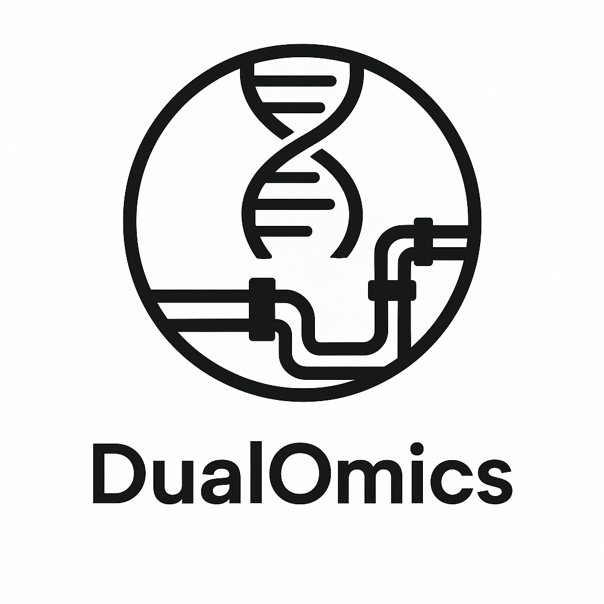

Omics Downstream Pipeline Documentation
======================================

A comprehensive bioinformatics pipeline for RNA-seq and TMT (Tandem Mass Tag) proteomics analysis. 
This pipeline provides end-to-end analysis capabilities including data preprocessing, differential 
expression analysis, and functional enrichment analysis.

Features
--------

* **RNA-seq Analysis**: Complete workflow from raw count data to differential expression and enrichment analysis using DESeq2
* **TMT Proteomics Analysis**: Comprehensive proteomics pipeline with normalization, batch correction, and differential expression using Limma
* **Flexible Configuration**: Support for both command-line arguments and JSON configuration files
* **Quality Control**: Built-in PCA, UMAP visualization, and OXPHOS complex analysis
* **Enrichment Analysis**: Automated functional enrichment analysis with customizable databases

.. toctree::
   :maxdepth: 2
   :caption: Contents:

   installation
   usage
   rnaseq
   tmt

Indices and tables
==================

* :ref:`genindex`
* :ref:`modindex`
* :ref:`search`
